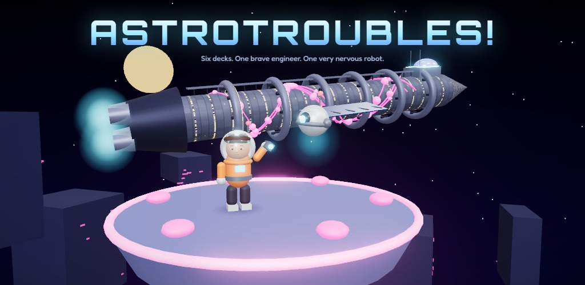
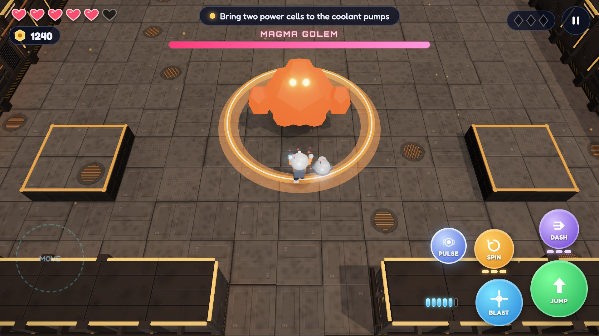
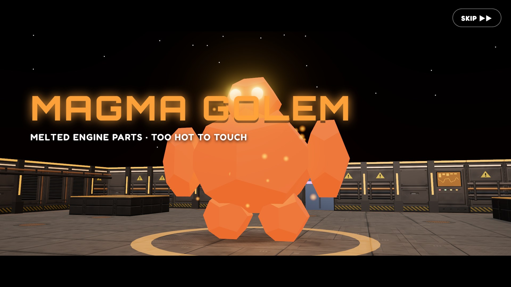
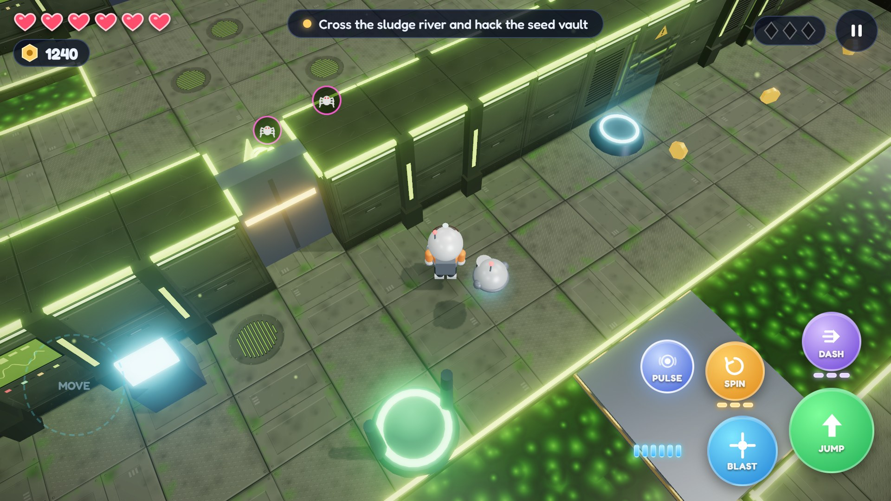
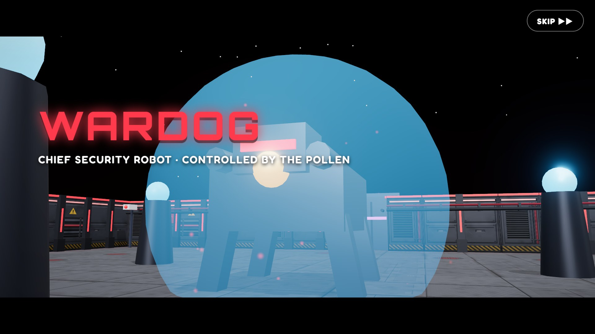
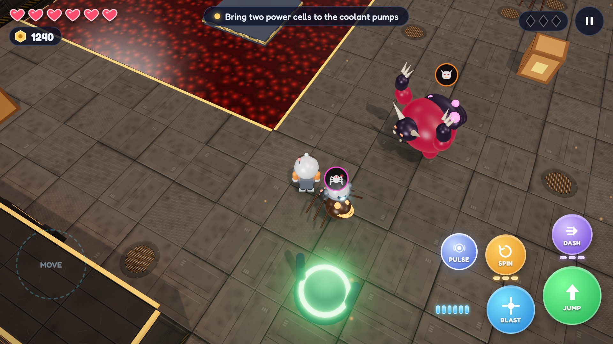
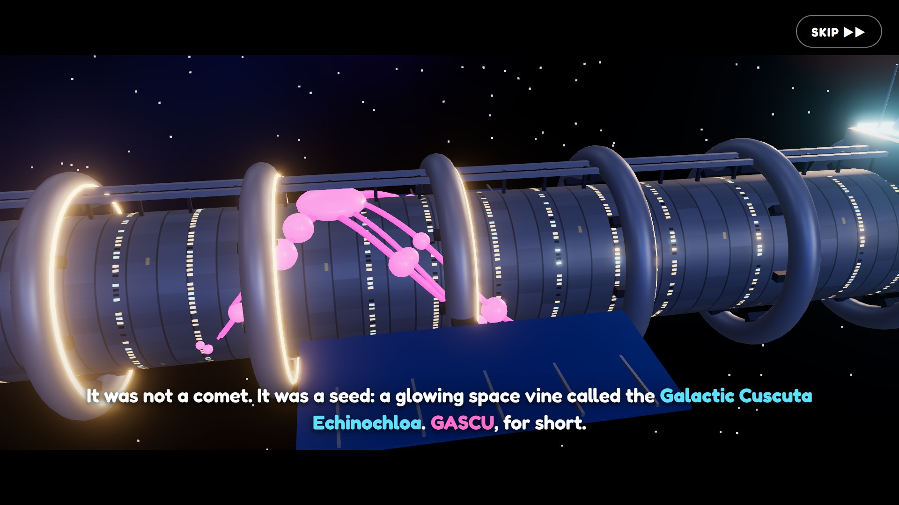

# Argonauts of the Galaxy



*In Greek: Αργοναύτες του Γαλαξία*

(It used to be called AstroTroubles!, and the Android package id still is the old one so updates install over it.)

A 3D action-adventure platformer for Android, built with three.js inside an Expo / React Native app. Open source under the MIT license, and coming to Google Play.

The colony ship *Syracusia* is carrying ten thousand sleeping colonists when a glowing space vine, the Galactic Cuscuta Echinochloa (**GaScu** for short), grows over every deck and starts steering the ship toward a star. You play **Jason**, a junior engineer who wakes up early. Together with **LUX**, a nervous little repair drone who's scared of the dark, Jason climbs six decks to reach the Bridge. Along the way you rescue colonists, collect memory shards, and find out what GaScu really wants.

In **Chapter 2** the ship reaches its new home, the planet **Gaia Nova** (Γαία Νόβα), only to find General Brennus waiting. Forty years ago he led the planet's first expedition, and when he tried to destroy the heart of all its plants, a great glowing flower the scientists named **Celestia**, they mutinied and launched it into space. Celestia is GaScu: that is why it turned the ship away, it was running from him. In Chapter 2 it goes by its real name. Brennus has captured the science team and stolen Celestia to power his Thorn Legion and the Colossus inside the volcano Mount Atlantas. Jason and LUX cross six outdoor regions to free them both, though not always together: Brennus has his eye on LUX too, and in the jungle Jason meets a new droid, **IRIS**, who speaks in rainbows.

It's made for players around 10 and up: bright, forgiving, and about 5–6 hours long across both chapters if you hunt for the secrets.

| | |
| --- | --- |
|  |  |
|  |  |
|  |  |

## Highlights

- **The whole game is one offline HTML page.** The game is TypeScript and three.js, and esbuild bundles it, fonts included, into a single 1.5 MB page. The Expo app shows that page full screen in a WebView and handles what the page can't: saving, haptics, the Android back button and screen orientation.
- **No asset files.** Characters, bosses and levels are built from code, textures are drawn on canvases at runtime, and all music and sound effects are synthesized with the Web Audio API.
- **Levels are ASCII maps, checked by a solver.** A reachability checker simulates Jason's jumps, dashes and hovering on every deck. It reports anything Jason can't reach, checks that each deck really needs its new ability, and times the fastest route through every countdown puzzle to prove it can be beaten with time to spare. The Jest suite runs the same checks.
- **In-engine cutscenes.** A small cutscene director moves the camera through the real level and adds letterbox bars, boss name cards and slow-motion finishes.
- **Storybook pictures.** The big story moments also get hand-drawn cartoon illustrations, written as inline SVG, that slowly pan inside a picture frame while the narration plays.
- **Built for phones.** Each deck frees its GPU memory when you leave it. Shaders compile behind the title cards so play doesn't stutter. The quality preset on first launch is picked from the phone's CPU core count.
- **Two languages.** English and Greek, with a test that fails if any visible string is missing its Greek translation.

## Running it on your phone

You need Node 20+ and the **Expo Go** app (SDK 57) on an Android phone.

```bash
npm install
npm start          # builds the game page, then starts Expo
```

Scan the QR code with Expo Go. The game runs in a WebView (`react-native-webview`, included in Expo Go), so you don't need a custom build. Hold the phone in landscape.

To build an installable APK:

```bash
npx eas-cli@latest build -p android --profile preview
```

EAS runs `npm run game:build` automatically after installing dependencies (`eas-build-post-install`).

### Playing on a computer

```bash
npm run game:build     # writes game/dist/index.html
```

Open `game/dist/index.html` in a browser. Keyboard: **WASD / arrows** move, **Space** jumps, **J** blasts, **K** spins or ground-pounds, **L / Shift** dashes, **I** fires LUX's force pulse, **E** is the action button, **Q / R** turn the camera, **Esc** pauses, and **C** (or **Tab**) switches heroes where you can. `npm run game:dev` rebuilds on every save.

Developer shortcuts (desktop browser only): `#deck=<id>` jumps into a deck (`&still` skips the fly-over, `&all` hands over every ability), `&heroes=jason,atalanta` lets you switch heroes on any deck, `&hero=atalanta` starts as Atalanta, and `&course` swaps the deck for a small practice course with every hero gadget (a sprint gap, a wall-run, a low gap and an arrow target).

## How to play

| Control | What it does |
| --- | --- |
| Left side of the screen | Joystick: move |
| Drag on the right side | Turn the camera |
| **JUMP** | Jump. Hold for higher jumps; with the Jet Boots, press again in mid-air |
| **BLAST** | Tap to shoot (it aims at the nearest enemy). The clip holds 6 shots, then Jason reloads. **Hold** to charge a big fireball that bursts on impact; it costs 3 shots, and if the clip is too low, holding reloads it while the charge builds |
| **SPIN** | Spin attack that also blocks enemy attacks and bats their shots back (lasers and lava still hurt). Jason gets 3 spins in a row, then a long recharge. In mid-air it becomes a **ground pound**, which presses red switches, hurts more and never runs out |
| **DASH** | Zoom forward, even in mid-air (after the Engine Core), ramming through enemies for heavy damage. Each dash uses one of 3 energy cells, refilled at checkpoints and by violet energy cells (enemies drop them, and chargers sit before every jump that needs a dash) |
| **PULSE** | LUX's force pulse (after the Security Deck's armory): a shockwave that hits and stuns every enemy around Jason, wipes out their shots and shorts out lasers and zap floors for a few seconds. It takes 16 seconds to recharge |
| **GRAPPLE** | The grapple hook (found in the Glass Desert): look toward a glowing ring and press the LUX button to zip straight over to it, across gaps and up cliffs |
| **Weapon button** | On Gaia Nova, once Jason owns a second weapon: switch weapons (or press **X** on a keyboard) |
| LUX button | Appears near terminals, pylons, signs, the shop, lifts and grapple rings. It wears the face of whoever is helping Jason: LUX, IRIS, or (when Jason is on his own) his wrist computer, the ACTION button |
| **Switch** (a face button above the others) | On levels with two heroes: switch to the hero whose face it shows, right where you stand (or press **C**). It works on the ground, between moves, with a one-second cooldown. The other hero follows you around, and hearts, armor, spins and bolts are shared |

#### Playing as Atalanta

Atalanta, the colony's fastest runner and best archer, joins in Chapter 3. Her buttons do different things:

| Control | What it does |
| --- | --- |
| Move | She runs faster than Jason. Keep the stick pushed **all the way** (or hold a direction key) and she breaks into a **sprint** for long jumps; a sharp turn or letting go ends it |
| **JUMP** | One strong jump (higher than Jason's first jump, but no jet boots). Jump while touching a wall to **wall-jump** off it (not off the same wall twice in a row). In mid-air, run at a wall with a glowing **teal stripe** to **wall-run** along it, and jump to kick off |
| **BOW** (the BLAST button) | Tap for quick arrows that fly far and straight. **Hold** to charge a **power arrow** that goes through up to 4 enemies and is the only thing that sets off a **bullseye target**. No clip, just a short cooldown; Blaster Power makes her arrows stronger |
| **KICK** (the SPIN button) | A spinning kick that blocks enemy shots like Jason's spin (from the same charges), on the ground or once in mid-air |
| **SLIDE** (the DASH button) | A low, fast slide that trips enemies and fits under **low gaps** (the walls with yellow-and-black stripes). Under a low ceiling she crawls until there's room to stand. Jump out of a slide for a long jump. It needs no energy cells |

She has no grapple, no ground pound and none of Jason's weapons: red floor switches and grapple rings need Jason, low gaps and bullseyes need her.

#### Playing as General Brennus

On his own levels in Chapter 3 (level 3, Aeëtes's Mine, and later level 8) you play General Brennus, alone: he never switches with the others. He is old, slow and strong, with a low jump (two steps up at most) and no jet boots, glider or grapple:

| Control | What it does |
| --- | --- |
| **CANNON** (the BLAST button) | A heavy shell on a low arc that splashes everything around where it lands. **Hold** for a **big blast** that smashes **cracked walls** (rock with glowing gold cracks) and knocks robots' shields away. No clip: a short cooldown and a **heat** gauge beside the button. Too many shots in a row and the cannon overheats, and he has to wait for it to cool |
| **SHIELD** (the SPIN button, held) | Raises the Legion's big shield: every shot and bump from the front is blocked (shots bounce back), but he walks slowly behind it. Let go to **bash** forward. In mid-air, the button is a heavy **stomp** that presses red switches |
| **CHARGE** (the DASH button) | A shoulder charge along the ground that smashes crates, crate barricades and cracked walls and knocks robots over. **Jump while charging** for a **charge-leap**, the only way he gets across two-cell gaps. It needs no energy cells |
| **COMMAND** (the action button) | At a Legion **command post**, his old Thorn Legion robots (painted gold by Aeëtes) obey his voice: one marches onto a **heavy plate** that holds a gate open, a **hauler** robot carries him over a gap, or a whole squad switches sides and fights for him |

His signs and hints are in his own voice (there is no droid with him); his wrist computer still hacks terminals. Developer shortcut: `#deck=mine` plays his level, and `&hero=brennus` puts him on any deck.

#### Driving the bronze mech

In Talos's Forge, Jason and Atalanta start on foot, then find the Gardeners' bronze **mech** asleep in the old forge and climb aboard: Jason sits in the glass bubble on top and steers, Atalanta rides on its shoulder, and LUX and IRIS fly alongside. From then on the mech is the only hero (nobody switches or gets out). It is twice Jason's height, a little slower, with one strong jump (four steps up) and no double jump, glider or grapple:

| Control | What it does |
| --- | --- |
| **PUNCH** (the SPIN button) | A one-two of big bronze fists just in front of it: they break **bronze gates**, crates and cracked walls, knock robots flat, and knock **Talos's ankle armour** off |
| **SLAM** (SPIN in mid-air) | Straight down like a ground pound: it presses red switches and smashes **cracked floor plates** (iron plates with glowing cracks), dropping the mech into the cellar or trench below. Any heavy landing from high up does too |
| **THRUST** (the DASH button) | A burst of its back jets, straight ahead, on the ground or once per jump. Gravity pauses while the jets fire, so **jump, then thrust** to cross a wide lava channel |
| **CANNON** (the BLAST button) | A heavy shell on a slow rhythm; **hold** for a big blast. No overheating |

Developer shortcut: `#deck=forge&flags=mech` starts in the mech (`&flags=forgelit` wakes the forge, so walking up to the mech plays the boarding scene).

A gold marker on screen points to where the current objective wants you to go, for example the launch tower and King Bloblin's island on the Habitat Ring, or the lift once a deck's boss is beaten.

Jason finds a new ability on each deck, and it's needed to finish that deck:

| Deck | New trick | Boss |
| --- | --- | --- |
| 1. Cryo Deck | Find LUX in the dark storeroom; hacking | Frost Warden |
| 2. Hydroponics | Jet Boots (double jump) | Vine Queen |
| 3. Engine Core | Dash Thrusters | Magma Golem |
| 4. Habitat Ring | Hover Pack (hold JUMP to float) | King Bloblin |
| 5. Security Deck | LUX's Force Pulse (shorts out lasers) | CERBERUS |
| 6. The Bridge | Everything at once | The Heart of GaScu, then GaScu Reborn |

Chapter 2 takes place outdoors on Gaia Nova. Jason keeps every ability, finds the grapple hook, and meets wind gusts, quicksand and rolling boulders:

| Region | New trick | Boss |
| --- | --- | --- |
| 1. Whispering Plains | River rafts, windy ridges | The Thresher (make it crash, then hit its engine) |
| 2. Glass Desert | The grapple hook; quicksand and sandstorms | The Dune Driller (hit its drill head when it surfaces) |
| 3. Frostpeak Tundra | Ice, blizzards and rolling snowballs; the prison camp | BOREAS (block from the front, blast its back) |
| 4. Titan Rockies | Grapple climbs, boulders, cable cars; no droid (wrist hacking, helmet lamp, no PULSE) | STHENO, the Gorgon's gunship (shoot its three engines) |
| 5. Thornwood Jungle | Wake IRIS; shut down the pollen pumps; dark root caves | The Thorn Hydra (heads first, then the heart) |
| 6. Mount Atlantas | Everything at once, inside a volcano | Shadow LUX (blast the chip on his back when he overheats), then the Colossus, General Brennus's war machine |

Chapter 3, **The Argonauts**, is the voyage of the Argo to the moon Colchis (it's being built level by level; the levels still to come show as "coming soon"):

| Level | New trick | Boss |
| --- | --- | --- |
| 1. The Clashing Rocks | Fly the Argo through an asteroid belt; follow LUX's dove through the slamming rocks | (Aeëtes's salvage drones) |
| 2. Harpy Isles | Atalanta joins: switch heroes. Bullseyes, wall-jumps, wall-runs and low gaps for her, red switches and grapple rings for Jason; updrafts, gusts and bolt-snatching harpy drones | AELLO, the Harpy Queen (Atalanta's power arrow knocks her down, Jason cracks her core) |

- **Hacking** a terminal is a puzzle, and the kind changes from deck to deck: the light-pattern memory game (watch LUX's lights, then repeat them), **What comes next?** (find the rule in a row of shapes, arrows or dots), **Power grid** (each tap flips a tile and its neighbours; light them all) and **Colour square** (fill the gaps so no row or column repeats a colour). The puzzles live in `game/src/game/puzzles.ts`.
- **Upgrades show on Jason.** Every shop upgrade adds gear to his suit: chest plate and shoulder pads (gold at the top level), blaster coils and a power cell, a drum magazine and a belt of spare cells, cooling fins and a gauntlet, a LUX link and a second antenna, and a magnet on his backpack.
- **LUX** lights dark rooms and hacks terminals, but in a fight he only stuns enemies now and then. Upgrade his zapper at PANDORA's shop to make it hurt. **IRIS** does all the same jobs (her zap is rainbow-coloured), and while no droid is around, Jason hacks with his wrist computer and his helmet lamp lights the dark, but there is no force pulse and no zap.
- **Bolts** are money. Spend them at PANDORA's shop on extra hearts, blaster power, a bigger clip, quicker reloads, a stronger LUX zap and a bolt magnet.
- **New weapons on Gaia Nova.** Once Jason reaches the planet, PANDORA's shop gets a Weapons tab: **Spread Shot** (three shots in a fan), **Frost Ray** (slows enemies; a charged shot freezes them solid), **Thunder Arc** (lightning that jumps to nearby enemies) and **Seeker** (slow shots that chase their target). Every weapon keeps the clip, reload and charged shot of the Blaster, and grows with Blaster Power. Bosses resist the cold.
- **Mk II upgrades.** In Chapter 2 the shop also sells a further level of every upgrade (the heart plating can now take Jason up to 12 hearts) and four new ones: **Armor Plating** (blocks a hit, then recharges), **Dash Cell** (an extra dash), **Spin Charge** (an extra spin) and **Grapple Range** (a longer, faster grapple).
- **Checkpoints** heal you. Falling or touching sludge, lava or electric water costs one heart and puts you back on the last safe ground. If you run out of hearts, you restart at the last checkpoint, and every enemy on the deck comes back. They also come back whenever you return to a deck, but rooms you've cleared stay open.
- **The final battle.** Beating the Heart of GaScu isn't the end: it pulls every vine on the ship into itself and rises again as GaScu Reborn, a floating titan that is only hurt while its great eye is open. It has 80 health, plus 16 for each level of Blaster Power, so it stays a long fight.
- **The Colossus**, chapter 2's final boss, is longer still: 110 health plus 20 per Blaster Power level, in three phases (shield generators, swinging arms, overheating core).
- **Journal pages.** On Gaia Nova the collectibles are the 18 pages of General Brennus's journal, telling how a boy who named all 300 of his grandmother's tomato plants became a man who wants to own a whole planet. Like memory shards, every 6 give an extra heart.
- **Gardener light-stones.** In Chapter 3 every level on foot hides three glowing rainbow stones left by the Gardeners, Celestia's people (21 in the whole chapter). Each one teaches LUX and IRIS another word of Celestia's light-language, and every 6 give an extra heart. Instead of cocoons, Chapter 3 has things to win back: on the Harpy Isles, gold harpy nets stuffed with old Phineus's stolen food (blast them open).
- **Harpy drones** (Chapter 3) are Aeëtes's gold thief birds: one circles you, flashes its red eye, then swoops in and snatches a handful of bolts. Blast it (or arrow it) and it drops everything it stole; a spin or kick bats it away.

### Enemies

Each enemy type has a floating icon and a health bar, and the first time you meet one, a small card under your hearts names it and gives a tip:

| Enemy | Its plan |
| --- | --- |
| Spore Crawler | Hunts in packs. When one spots you it calls the others, and they surround you |
| Maw Plant | Hides among the roots and bites when you walk too close |
| Stinger Wasp | Circles you, shoots where you're going, and dives in while you reload |
| Warden Bot | Patrols, and sounds an alarm that wakes the guards nearby. Its front shield blocks shots, but it turns slowly and freezes to vent after each burst: hit the glowing pack on its back for triple damage |
| Spitter Pod | Lobs acid at where you'll be when it lands |
| Horned Brute | Charges; if it misses, it stomps in anger |

On Gaia Nova, General Brennus's Thorn Legion sends its robots too:

| Robot | Its plan |
| --- | --- |
| Legion Trooper | Sidesteps across your path, its red lens glows, then it fires three slow shots: run sideways |
| Roller Mine | Rolls up to you and puffs up over a red circle before it pops. Blast it first and it just fizzles |
| Shield Bulwark | Its tower shield blocks everything from the front. Get behind it and hit its glowing pink core, or drop the shield with a ground pound or LUX's zap |
| Mortar Bot | Lobs shells at a red circle on the ground. Step out of the circle, then get close: it can't aim at its own feet |
| Anvil Drone | One of Aeëtes's gold work drones (Talos's Forge). It hovers high with an iron anvil on a cable and drops it on a red circle; then it swoops down low to hook the anvil back up. Step out of the circle, then punch it while it's low (or blast it any time) |

Enemies get tougher deck by deck: more health, faster attacks, sharper senses. They also scale up a little with every weapon upgrade and new weapon you buy. From the Engine Core on, some are **elites** with a gold crown: bigger, tougher and worth more bolts.

### Side quests and rewards

Every deck has four side quests, listed with their rewards in the pause menu. LUX also explains each kind of collectible the first time you get close to one.

- **Free the colonists** trapped in pink GaScu cocoons (blast them open): 25 bolts each, plus a bonus when the whole deck is free.
- **Find the memory shards** (glowing pink crystals): a bolt bonus per deck and an extra heart for every 6. All 18 unlock the secret ending, where LUX *speaks* to GaScu instead of fighting it.
- **Find the hidden heart canister** for one more max heart. They're often behind cracked walls (spin or blast them).
- **Crack the secret vault.** Each deck has one, locked behind a harder puzzle, and the chest inside holds a free upgrade:

| Deck | Vault puzzle | Prize |
| --- | --- | --- |
| Cryo Deck | Step on the colour pads in the order a sign gives | Bigger Clip |
| Hydroponics | Ground-pound three switches within 21 seconds | +1 max heart |
| Engine Core | A four-colour code on islands in the lava, worked out from three clues | Blaster Power |
| Habitat Ring | A colour riddle split between two signs on opposite sides of the Ring | Quick Reload |
| Security Deck | A five-round **What comes next?** hack switches off a laser corridor | LUX Zapper |
| The Bridge | Ground-pound four switches across the navigation room within 28 seconds | 300 bolts |

For the switch puzzles, a clock at the top of the screen counts down from the first switch, with a dot for each one that's down. A cracked vault stays open, even when you replay the deck.

**Replay a level** on the title screen lets you replay any deck or region you've reached.

Progress saves at every checkpoint and when you leave the app.

## The story

A new game opens with a prologue out in space: a glowing seed strikes the *Syracusia*, GaScu spreads over the hull, and the ship turns toward a burning star. Then Jason's cryo pod thaws. What happens next (**spoilers**):

- **Captain's logs.** Captain Argus left hologram messages on every deck as GaScu took over. They tell you what happened, and where to find his drone, LUX. On the Habitat Ring, the message is from Jason's Aunt Rosa instead.
- **Rescuing LUX.** Jason finds the Captain's little drone switched off in a dark storeroom, fixes him, and he tags along.
- **HALCYON is infected.** By the Security Deck, GaScu pollen has scrambled the ship computer, who turns on you and sends CERBERUS. Beating CERBERUS lets LUX reboot HALCYON. HALCYON then reveals that GaScu isn't angry, it's scared: someone on the planet the ship is flying to once tried to hurt it, and it would rather fly into the star than go back.
- **Story characters.** Freeing Aunt Rosa (Security) and the Captain (the Bridge) from their cocoons plays a scene with each of them.

Cutscenes play in the game world with letterbox bars:

- Every deck opens with a fly-over, and every boss makes an entrance with its own name card.
- Boss defeats play in slow motion, and each deck ends with a lift ride.
- Between decks the lift climbs the outside of the ship while the crew talks, and the star looks bigger every time.
- Both endings have their own cinematic, followed by credits that list the colonists you rescued.
- The biggest moments (the seed striking the ship, LUX waking up, the Heart of GaScu, Brennus's broadcast, the expedition forty years ago, LUX carried off, IRIS waking up, LUX coming home...) are shown as storybook pictures between the camera shots.

**Chapter 2: Gaia Nova** (more spoilers):

- **The arrival.** The ship reaches Gaia Nova and sends Dr. Hypatia's science team down first. Their radio goes quiet, General Brennus broadcasts that the planet is his (and that GaScu's real name is Celestia), and his drones steal it. Jason and LUX take the shuttle down.
- **The first expedition.** Dr. Galen, freed in the snow, slept for forty years: he was one of the twelve scientists who came here with Brennus. His story plays as storybook pictures: the planet fighting back, Brennus's order to destroy Celestia, the mutiny, and the escape pod that carried it into space.
- **The journey.** Each region frees two captured scientists (thorn cocoons) and beats one of Brennus's machines. Dr. Hypatia's field logs and Brennus's own recordings play on hologram projectors, and between regions the shuttle flies over the planet while the crew talks.
- **LUX is taken.** The moment BOREAS falls in the tundra, a snare drone drops out of the blizzard, cages LUX and carries him off to the volcano while Brennus gloats on the radio. Jason climbs the Titan Rockies alone, with HALCYON keeping him company on the radio.
- **IRIS.** In the jungle roots Jason switches on IRIS, a slim droid with a rainbow visor, fins and a golden halo. The Gardeners, the people who planted Celestia, built her long ago; Brennus dug her out of the desert ruins, and when she would not fight for him he threw her away. Calm, curious and a little poetic, she takes over LUX's jobs.
- **Shadow LUX.** In Mount Atlantas, Brennus has clamped thorny armour and a control chip onto LUX and sends him against Jason. Blast the chip whenever he overheats; twice, IRIS sings him a rainbow light-word, and when the chip breaks LUX is himself again. LUX and IRIS both fly with Jason up to the Colossus (and in the secret ending LUX still talks to Celestia).
- **Two endings.** Beat the Colossus and Gaia Nova is free. Or, with all 18 journal pages, press **TALK**: Jason reminds Brennus of his grandmother's garden, and he lets Celestia go himself (the secret ending).

**Chapter 3: The Argonauts** (more spoilers):

- **The Golden Fleece.** Celestia starts to fade: she is the last of her kind. Her people, the Gardeners, left a living golden cloak of seeds on Colchis, a moon of the gas giant next door. Captain Argus rebuilds the shuttle into the **Argo**, and the crew set off, with the salvage tycoon **Aeëtes** racing them for the Fleece.
- **The Clashing Rocks.** Jason flies the Argo through the asteroid belt and, following LUX's dove, between the slamming rocks.
- **The Harpy Isles.** Floating sky-islands over a sea of clouds. A distress beacon leads Jason to **Atalanta**, the colony's fastest runner and best archer, who flew ahead alone in her scout skiff until Aeëtes's harpy drones stripped it for parts. IRIS is her friend from the greenhouse, and from then on flies with her while LUX stays with Jason: the hero you play has their droid in the lead, and the other droid floats beside the other hero. They meet **Phineus**, a blind old stargazer whose dinner the harpies steal every evening, beat the Harpy Queen AELLO, and learn the way to Colchis. Then a message comes in: General Brennus has gone after Aeëtes on his own.
- **Aeëtes's Mine (level 3, General Brennus alone).** While the Argonauts fight on the Harpy Isles, Brennus flies the Gorgon's old lifeboat to Aeëtes's mining moon, talking to the little pot of Celestia's sprout on his belt: Captain Argus gave him a second chance (whether he was in the brig or in the garden after Chapter 2), and he means to pay his debts. Aeëtes is digging the whole moon into a golden pit with Brennus's own old Legion robots, which he found in the snow and painted gold, and he taunts Brennus on the radio all the way. Brennus blasts through cracked rock, charge-leaps into the mine, marches up a walkway under fire behind his shield, orders a robot onto a heavy plate, rides an ore cart over the pit and turns a whole squad back to his side. The boss is **THE GOLD EXCAVATOR**, his old digging machine "Rumble" with Aeëtes's control box bolted on: block its charges with the shield (or make it crash into a pillar), blast the box, and when it kneels, **COMMAND** it to stand down. In Aeëtes's office he finds the golden map to the Fleece vault on Colchis and sends it to the Argo; next stop, the Sirens' Sea (coming soon).
- **Talos's Forge (a mech level).** Past Scylla's Reef lies a bronze volcanic island, and walking his rounds on it is **TALOS**, the Gardeners' ancient bronze guardian, reprogrammed by Aeëtes's gold crown to stomp anyone who lands. On foot, Atalanta's power arrow lowers the drawbridge over the lava moat, Jason grapples up to the forge's high door and Atalanta slides under it; a hologram from Dr. Hypatia translates the carvings: the plug in Talos's heel is his off-switch. In the forge sleeps the Gardeners' bronze mech (“strong hands for gentle work”), and everyone climbs aboard. The mech punches the bronze gate open, jumps and thrusts over lava channels under **anvil drones**, slams through the cracked casting floor into a trench under the wall, and slams two red switches to open the arena. **TALOS** stomps (the foot sticks in the floor: punch his ankle armour off), swings his forge hammer, and in later rounds Aeëtes sends anvil drones and Talos throws hot rivets; each time his armour is off he kneels, and the mech pulls the plug a little further. After the third pull the golden light drains away like warm honey and he sits down by the sea, free, his eye teal again, and gives the Argonauts a slow, grateful nod. Behind him the labyrinth gate leads under Colchis, where Aeëtes's security system, MEDUSA, is waiting.

Tap to hurry a caption along, or press **SKIP** (or the Android back button) to skip a scene.

## Languages

The game is in English and Greek: in Greek it is called **Αργοναύτες του Γαλαξία**, Captain Argus is **Κυβερνήτης Άργος**, the ship is the **Συρακουσία**, Jason is **Ιάσονας** GaScu is **Γάκου** (Γαλαξιακή Κουσκούτα Εχινόχλοη) and Celestia is **Σελέστια**, and the app shows that name on phones set to Greek (`assets/languages/el.json`, for builds made with EAS). The game starts in Greek on a phone set to Greek, and you can switch at any time in **Settings**. The Greek is written as natural Greek for young players rather than word for word. Every string the player sees goes through `tr()` (`game/src/core/i18n.ts`) with its English text as the key, and the Greek table lives in `game/src/i18n/el.ts`. The game and ship names are in `game/src/core/brand.ts`; story text refers to the ship as `{ship}`. `npm run game:i18n` lists anything still missing, and the Jest suite fails if a visible string has no Greek. Fredoka and Orbitron have no Greek letters, so the build fills them in with just the Greek glyphs of M PLUS Rounded 1c and Play.

## Project layout

```text
game/                    the 3D game (TypeScript, three.js), bundled with esbuild
  build.mjs              bundles everything, fonts included, into one offline HTML page
  src/core/              input, audio (synthesized music and sound effects), save data, app bridge, translations
  src/world/             grid level parser, physics, level mesh builder, sky, particles, decor
  src/entities/          Jason, LUX and IRIS, enemies, bosses, pickups and interactive props
  src/entities/heroes/   the hero table and switching rules, Atalanta (model, moves, arrows), the follower,
                         hero props (arrow targets, wall-run walls, low gaps) and the dev practice course,
                         General Brennus (model, moves, cannon) and his Legion props (cracked walls, heavy
                         plates, command posts, his old robots), and the Gardeners' bronze mech (model, moves)
  src/entities/forge/    Talos's Forge: TALOS, the anvil drones, bronze gates and cracked floor plates
  src/cinema/            cutscene director, in-deck cutscenes, the ship exterior and space cinematics
  src/game/              game state machine, world simulation, title scene, story text
  src/levels/            the six decks as ASCII maps plus legends, objectives and dialogue
  src/i18n/              the Greek translation
  src/ui/                HUD, touch controls, menus, dialogue and hacking screens
  tools/                 level reachability checker (npm run game:check), translation check (npm run game:i18n),
                         app icon generator (npm run gen:icons)
  tests/                 Jest tests: deck data, reachability of every deck, physics, translations, review prompt
src/app/                 Expo Router screens: the WebView host (plus an iframe version for web)
src/generated/           game page as a string (generated, git-ignored)
assets/                  app icons and splash image, plus the app's name on phones set to Greek (languages/)
docs/                    privacy policy, plus the Google Play listing text, screenshots and store graphics
.claude/                 instructions and settings for Claude Code
```

The files left at the root are the ones each tool looks for there: `package.json`, `app.json` (Expo), `eas.json` (EAS builds), `tsconfig.json` and `eslint.config.js`.

### Levels

Each deck is an ASCII map. `#` is a wall, space is open void, `.` is floor, `1`–`9` are raised floor (half a unit per step), `~` is a hazard (sludge, lava, electric water), `_` is ice and `,` is a grate (a plank bridge outdoors). Gaia Nova regions get their natural look (ground, cliffs, sky, weather) from the region's theme, and can place grapple `anchor`s, `wind` zones, `quicksand` and rolling `boulder` lanes. Levels that list `heroes: ['jason', 'atalanta']` can also place arrow `target`s, `wallrun` walls and `lowgap` crawl holes, and General Brennus's levels (`heroes: ['brennus']`) `cracked` walls, heavy `plate`s, Legion command `post`s, idle `legionbot`s, and moving platforms dressed as ore carts or haulers (`look: 'cart' | 'hauler'`). Letters are placed from the deck's `legend`. `npm run game:check` simulates Jason's jump, double-jump, dash and hover ranges on every map. It also models grapple zips to anchors and, on levels with Atalanta, her jumps, sprint long jumps (after a two-cell run-up), wall-jumps, wall-runs, crawling through low gaps and power-arrow shots at targets, and on Brennus's levels his low jump, his charge-leaps and the cracked walls only he gets through; heroes can switch anywhere on the ground, so it also reports what each hero can't reach alone. It reports anything you can't reach, checks that each deck's new ability really is needed to finish it, that a checkpoint or energy charger (`=` in a map) sits before every jump that needs a dash, and that every countdown leaves time to spare: the fastest route may use at most half the clock, and even the slowest order of switches at most four fifths. The Jest suite runs the same checks.

## Development

```bash
npm run typecheck     # builds the game page, then runs tsc
npm run lint
npm test
npm run game:check    # per-deck reachability report (add a deck id and --map for a picture)
npm run game:i18n     # English strings still missing a Greek translation
```

## Releasing on Google Play

```bash
npx eas-cli@latest build -p android --profile production   # an .aab for Play Console
```

The Play listing text in English and Greek, the answers for Play Console's forms, the screenshots and the store graphics are in [docs/store/](docs/store/listing.md). The privacy policy the listing links to is [docs/privacy-policy.md](docs/privacy-policy.md).

The first time a player finishes decks 2, 4 and 6, the app asks Google Play to show its review card (`game/src/game/review.ts`, then `expo-store-review` in the app). Following Google's rules, it never shows a button or asks a question first. Google Play decides whether the card actually appears: it limits how often each player sees it, and it never shows in Expo Go or in builds that weren't installed from Play. To see it, install a build from an internal testing track.

## License

[MIT](LICENSE): you're free to read, change and reuse the code. The license covers the code; it doesn't give permission to publish another app under the Argonauts of the Galaxy or AstroTroubles! names or logo. The embedded fonts (Fredoka, Orbitron, M PLUS Rounded 1c and Play) are under the SIL Open Font License 1.1.
