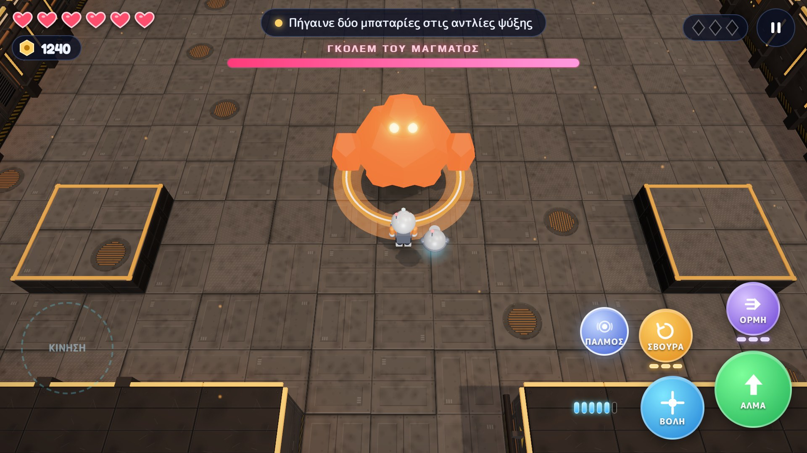
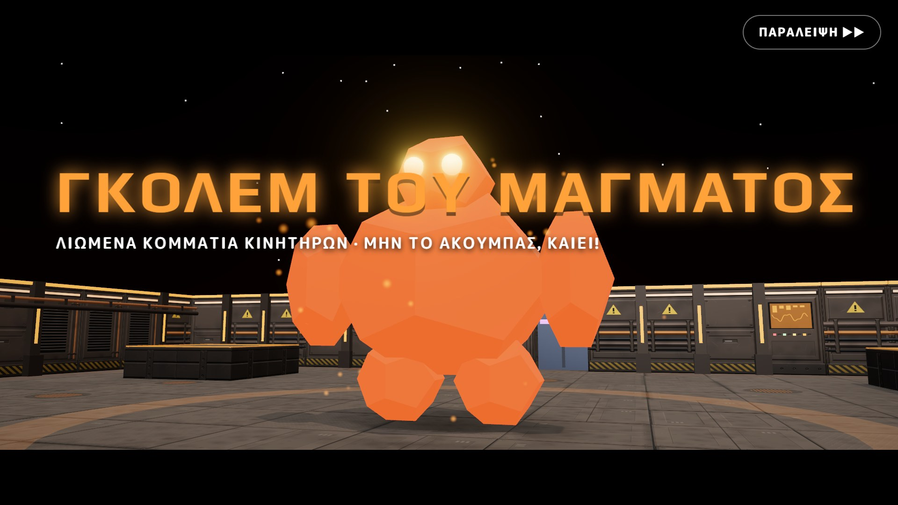
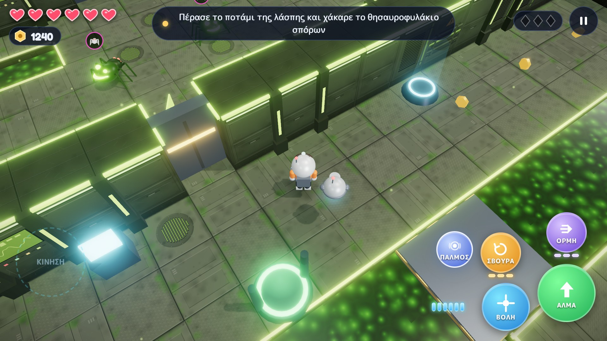
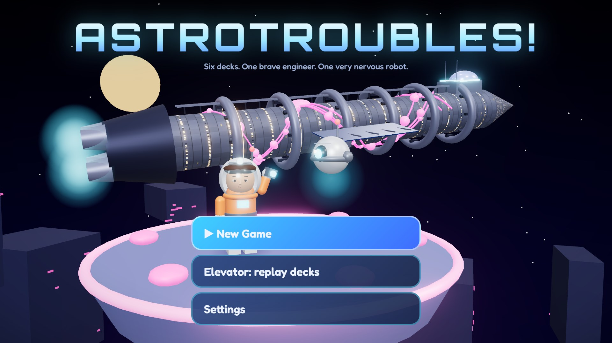
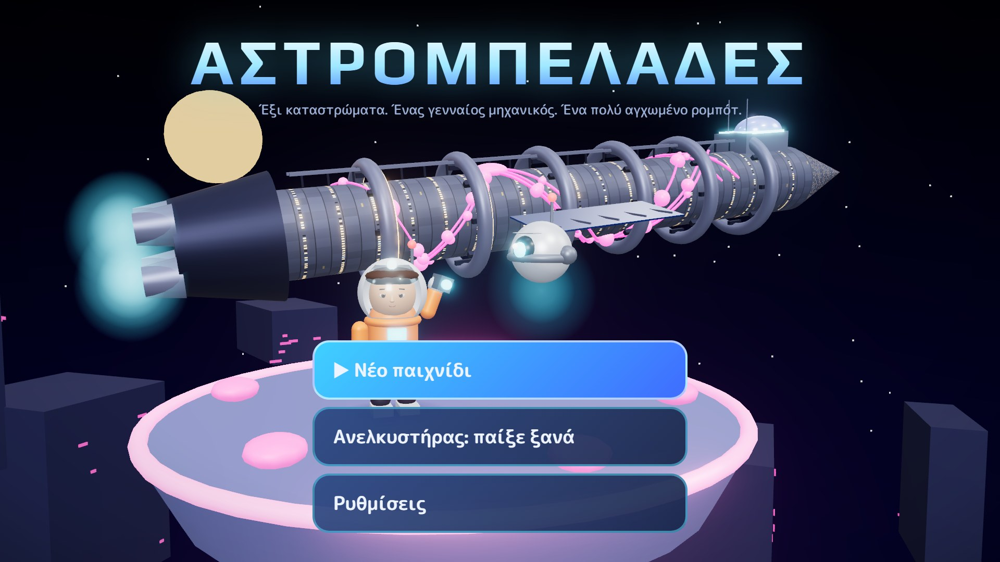
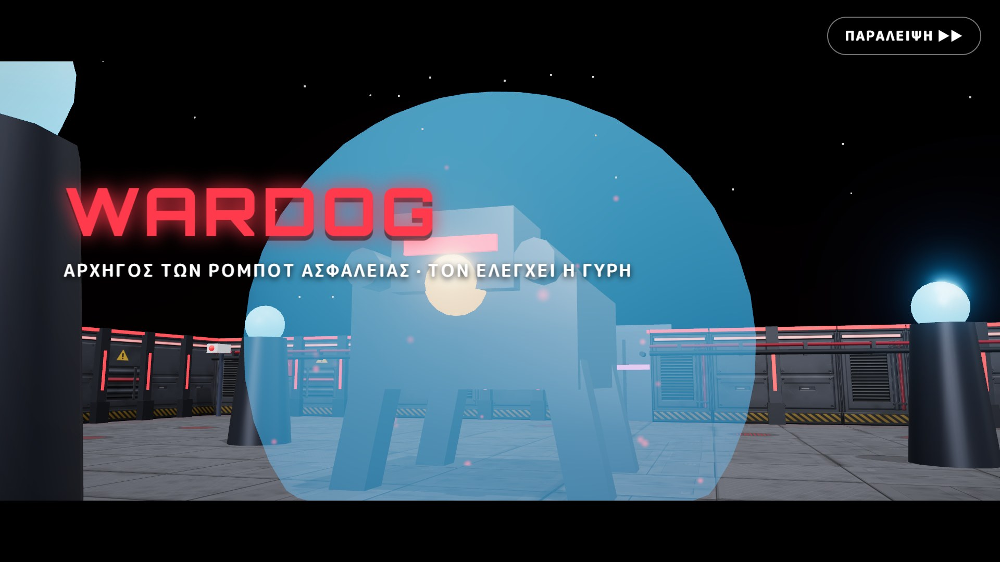
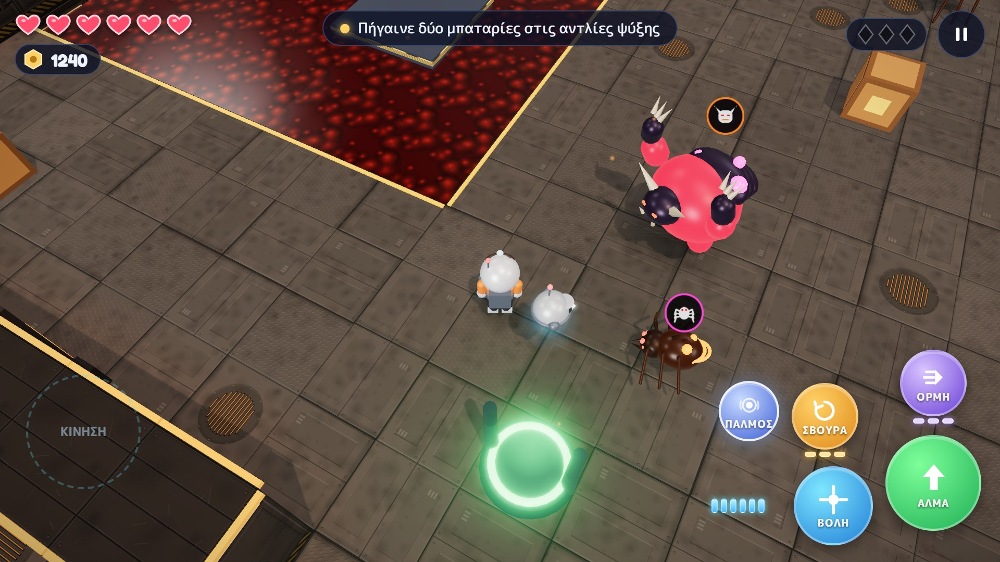
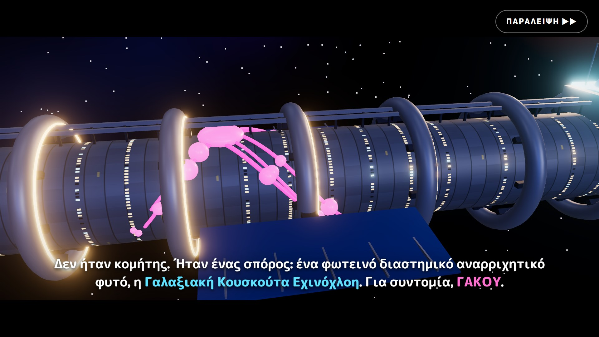
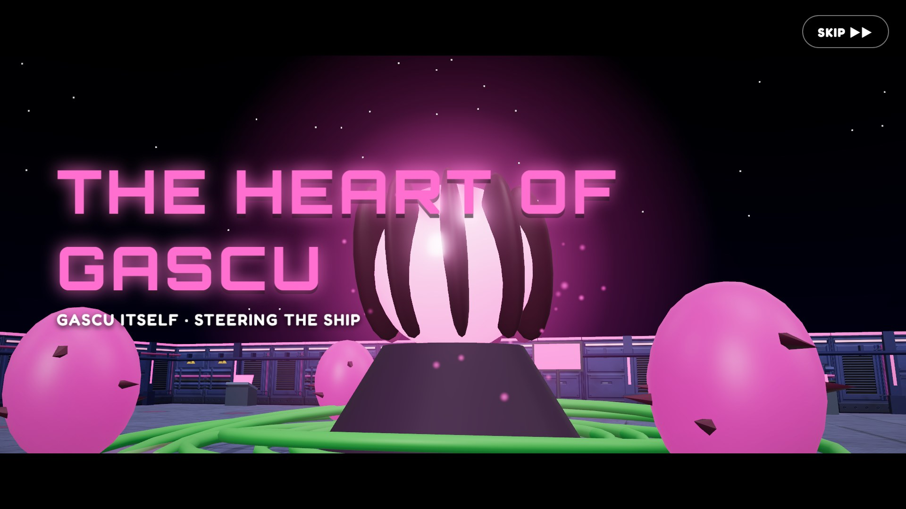
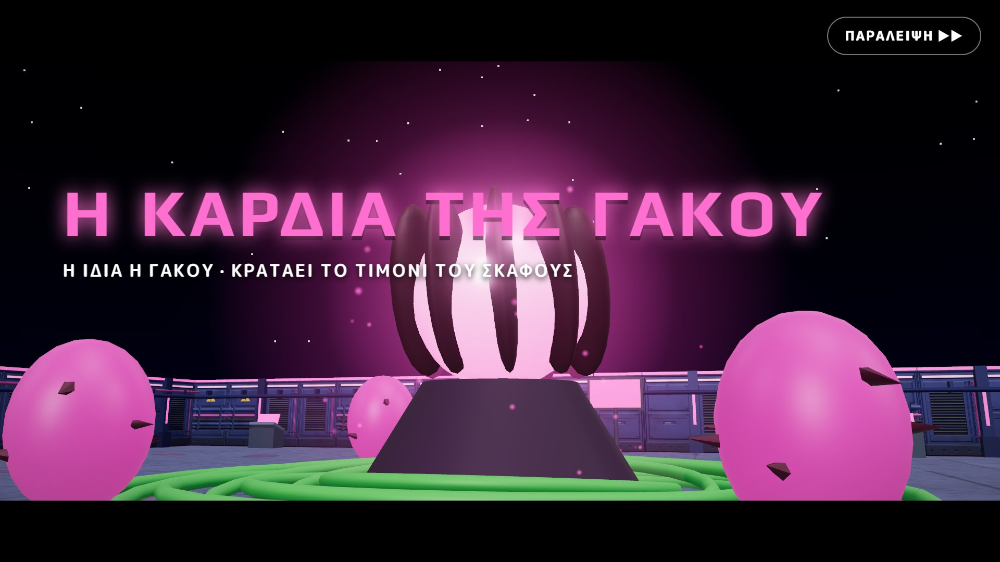

# Google Play listing

Everything to paste into Play Console for the first release, in English (default) and Greek. Character counts are checked against Play's limits by the snippet at the end of this file.

- **Package:** `com.hullbreach.leviathan` (this can never change after the first upload)
- **Default language:** English (United States), en-US, with a Greek (el-GR) translation
- **App or game:** Game. **Category:** Adventure
- **Free or paid:** Free. A free app can never become paid later.
- **Contact email:** [contact email] (shown publicly on the store page)
- **Privacy policy URL:** a public web address for [privacy-policy.md](../privacy-policy.md). See [Hosting the privacy policy](#hosting-the-privacy-policy).

## Graphics

| Asset | Play's requirement | File |
| --- | --- | --- |
| App icon | 512 × 512 PNG | [icon-512.png](icon-512.png) |
| Feature graphic | 1024 × 500 JPEG or PNG | [en/feature-graphic.jpg](en/feature-graphic.jpg), [el/feature-graphic.jpg](el/feature-graphic.jpg) |
| Phone screenshots | 2 to 8, 16:9, at least 1080 px | `en/01` to `en/08`, `el/01` to `el/08` (1920 × 1080) |

Upload the screenshots in file order. Play shows the first three most, so they're gameplay:

| # | English | Greek |
| --- | --- | --- |
| 1 |  |  |
| 2 |  |  |
| 3 |  |  |
| 4 |  |  |
| 5 |  |  |
| 6 |  |  |
| 7 |  |  |
| 8 |  |  |

The screenshots were taken from the real game running in a browser at 960 × 540, drawn at 2× (the same layout as a phone in landscape), using a test save with every ability unlocked. If the game's look or name changes, retake them.

## English (en-US)

**App name** (30 max)

```text
AstroTroubles!
```

**Short description** (80 max)

```text
Save a colony ship from a glowing space plant in a bright 3D action adventure.
```

**Full description** (4000 max)

```text
A glowing space vine called the Galactic Cuscuta Echinochloa, GaScu for short, has grown over every deck of the colony ship Syracusia, and it is steering ten thousand sleeping colonists straight toward a star.

You are Jason, a junior engineer who wakes up early. Together with LUX, a little repair drone who is scared of the dark, climb six decks to reach the Bridge, free the crew and find out what GaScu really wants.

SIX DECKS, SIX BOSSES
Frozen cryo bays, overgrown gardens, an engine core full of lava, a habitat ring with homes, a school and a playground, a security deck guarded by lasers, and the Bridge itself. Every deck ends with a boss: the Frost Warden, the Vine Queen, the Magma Golem, King Bloblin, CERBERUS and the Heart of GaScu.

A NEW TRICK ON EVERY DECK
Find Jet Boots for double jumps, Dash Thrusters, a Hover Pack and LUX's Force Pulse. Each one opens new paths, and you will need it to finish that deck.

BLAST, SPIN, DASH
Tap to shoot, or hold to charge a fireball. Spin to knock enemy shots back at them. Ground-pound switches. Hack terminals by repeating LUX's light patterns.

SECRETS FOR EXPLORERS
Free colonists from GaScu cocoons, find hidden heart canisters, crack a secret vault on every deck, and collect all 18 memory shards to unlock a different ending.

UPGRADES AT PANDORA'S SHOP
Spend the bolts you collect on extra hearts, a stronger blaster, a bigger clip, quicker reloads, a bolt magnet and a better zapper for LUX.

A STORY TOLD IN CUTSCENES
Captain's logs hidden around the ship, a ship computer that starts acting strangely, boss entrances with their own name cards, and two endings.

MADE FOR YOUNG PLAYERS AND EVERYONE ELSE
Bright, forgiving and about 2 to 3 hours long, for players of about 10 and up. Plays fully offline. No ads and no in-app purchases. In English and Greek.

Best played in landscape, with headphones.
```

**Release notes for version 1.0.0** (500 max)

```text
First release: six decks, six bosses and the whole story of the Syracusia.
```

## Greek (el-GR)

**App name** (30 max)

```text
Αστρομπελάδες
```

**Short description** (80 max)

```text
Σώσε ένα διαστημόπλοιο από ένα φωτεινό φυτό, σε μια πολύχρωμη περιπέτεια 3D.
```

**Full description** (4000 max)

```text
Ένα φωτεινό διαστημικό αναρριχητικό φυτό, η Γαλαξιακή Κουσκούτα Εχινόχλοη ή, για συντομία, Γάκου, έχει απλωθεί σε κάθε κατάστρωμα του αποικιακού σκάφους Συρακουσία, και οδηγεί δέκα χιλιάδες κοιμισμένους αποίκους κατευθείαν σε ένα αστέρι.

Είσαι ο Ιάσονας, ένας δόκιμος μηχανικός που ξυπνά πιο νωρίς από όλους. Μαζί με τον ΛΟΥΞ, ένα μικρό ρομπότ επισκευών που φοβάται το σκοτάδι, ανέβα έξι καταστρώματα ως τη Γέφυρα, ελευθέρωσε το πλήρωμα και μάθε τι θέλει στ' αλήθεια η Γάκου.

ΕΞΙ ΚΑΤΑΣΤΡΩΜΑΤΑ, ΕΞΙ ΓΙΓΑΝΤΙΟΙ ΑΝΤΙΠΑΛΟΙ
Παγωμένοι θάλαμοι κρυοΰπνου, κήποι που τους έχει καταπιεί η βλάστηση, ένας πυρήνας κινητήρων γεμάτος λάβα, ένας δακτύλιος κατοικιών με σπίτια, σχολείο και παιδική χαρά, ένα κατάστρωμα ασφαλείας με λέιζερ, και η ίδια η Γέφυρα. Κάθε κατάστρωμα τελειώνει με έναν γιγάντιο αντίπαλο: τον Φύλακα του Πάγου, τη Βασίλισσα των Κλημάτων, το Γκόλεμ του Μάγματος, τον Βασιλιά Μπλόμπλιν, τον ΚΕΡΒΕΡΟ και την Καρδιά της Γάκου.

ΚΑΙΝΟΥΡΓΙΟ ΚΟΛΠΟ ΣΕ ΚΑΘΕ ΚΑΤΑΣΤΡΩΜΑ
Βρες τις Τζετ-Μπότες για διπλό άλμα, τους Προωθητήρες Ορμής, το Σακίδιο Αιώρησης και τον Παλμό Ισχύος του ΛΟΥΞ. Το καθένα ανοίγει νέους δρόμους και θα το χρειαστείς για να τελειώσεις εκείνο το κατάστρωμα.

ΒΟΛΗ, ΣΒΟΥΡΑ, ΟΡΜΗ
Πάτα για να πυροβολήσεις ή κράτα πατημένο για να γεμίσεις μια βολίδα φωτιάς. Κάνε σβούρα για να στείλεις πίσω τις βολές των εχθρών. Πέσε με φόρα πάνω στους διακόπτες. Χάκαρε τερματικά επαναλαμβάνοντας τα φώτα του ΛΟΥΞ.

ΜΥΣΤΙΚΑ ΓΙΑ ΕΞΕΡΕΥΝΗΤΕΣ
Ελευθέρωσε αποίκους από τα κουκούλια της Γάκου, βρες κρυμμένα δοχεία καρδιάς, άνοιξε ένα κρυφό θησαυροφυλάκιο σε κάθε κατάστρωμα και μάζεψε και τα 18 θραύσματα μνήμης για ένα διαφορετικό τέλος.

ΑΝΑΒΑΘΜΙΣΕΙΣ ΣΤΟ ΜΑΓΑΖΙ ΤΗΣ ΠΑΝΔΩΡΑΣ
Ξόδεψε τις βίδες που μαζεύεις σε περισσότερες καρδιές, πιο δυνατό όπλο, μεγαλύτερο γεμιστήρα, πιο γρήγορο γέμισμα, μαγνήτη για βίδες και καλύτερο ηλεκτρικό τσίμπημα για τον ΛΟΥΞ.

ΜΙΑ ΙΣΤΟΡΙΑ ΜΕ ΚΙΝΗΜΑΤΟΓΡΑΦΙΚΕΣ ΣΚΗΝΕΣ
Ημερολόγια της Κυβερνήτριας κρυμμένα σε όλο το σκάφος, ένας υπολογιστής του σκάφους που αρχίζει να φέρεται παράξενα, αντίπαλοι που κάνουν την είσοδό τους με το όνομά τους σε μεγάλα γράμματα, και δύο διαφορετικά τέλη.

ΓΙΑ ΜΙΚΡΟΥΣ ΚΑΙ ΜΕΓΑΛΟΥΣ
Πολύχρωμο, χωρίς άγχος, με διάρκεια περίπου 2 με 3 ώρες, για παίκτες από 10 ετών και πάνω. Παίζεται χωρίς σύνδεση στο διαδίκτυο. Χωρίς διαφημίσεις και χωρίς αγορές μέσα στην εφαρμογή. Στα ελληνικά και στα αγγλικά.

Παίζεται καλύτερα με το κινητό οριζόντια και με ακουστικά.
```

**Release notes for version 1.0.0** (500 max)

```text
Πρώτη κυκλοφορία: έξι καταστρώματα, έξι γιγάντιοι αντίπαλοι και όλη η ιστορία της Συρακουσίας.
```

## App content answers

These are the answers for Play Console's **Policy → App content** forms, based on what the game actually does. Check them again if the game changes.

| Form | Answer |
| --- | --- |
| Privacy policy | The public URL of `docs/privacy-policy.md` |
| Ads | No, the app contains no ads |
| App access | All functionality is available without any access restrictions |
| Content rating (IARC questionnaire) | Category: Game. Violence: yes, cartoon or fantasy violence against robots and monsters, with no blood or gore and no realistic human violence. No sexual content, bad language, drugs, alcohol or gambling. No user-to-user chat or sharing, no location sharing, no digital purchases. Play gives the final rating; expect about PEGI 7 / ESRB Everyone 10+ |
| Target audience | 9 to 12, 13 to 15, 16 to 17 and 18+. Including 9 to 12 means the [Families policy](https://support.google.com/googleplay/android-developer/answer/9893335) applies, which the game already meets: no ads, no data collection, no purchases |
| Data safety | "Does your app collect or share any of the required user data types?" **No.** The save stays on the device and is never sent anywhere |
| Government app, financial features, health, news | No |

The build asks Android for only two permissions: **vibration** for haptics, and **internet**, which React Native includes by default and the game never uses. `app.json` blocks the storage and "display over other apps" permissions that Expo's Android template adds, because the game doesn't need them.

## Hosting the privacy policy

Play needs a public, non-editable web page, not a PDF. Two easy options:

- **GitHub:** push this repo as a public repository, then use the link to `docs/privacy-policy.md` on github.com, or turn on GitHub Pages for the `docs/` folder.
- **Any free site**, such as Google Sites: paste the policy's text into a page.

Replace `[contact email]` in the policy and in this file with the address you want players to see. Play also shows it on the store page.

## Before you submit

1. Build the app bundle: `npx eas-cli@latest build -p android --profile production`.
2. For a personal developer account, run a closed test first: at least 12 testers, opted in for 14 days in a row. Only then can you apply for production.
3. Upload the first `.aab` by hand in Play Console. Later builds can use `eas submit`.

## Checking the character limits

Run this from the project root after editing the text above:

```bash
node -e "const t=require('fs').readFileSync('docs/store/listing.md','utf8');const b=[...t.matchAll(/\*\*(.+?)\*\* \((\d+) max\)\s+\`\`\`text\n([\s\S]*?)\n\`\`\`/g)];for(const[,n,max,s]of b)console.log((([...s].length<=+max)?'ok  ':'LONG')+' '+[...s].length+'/'+max+'  '+n)"
```
